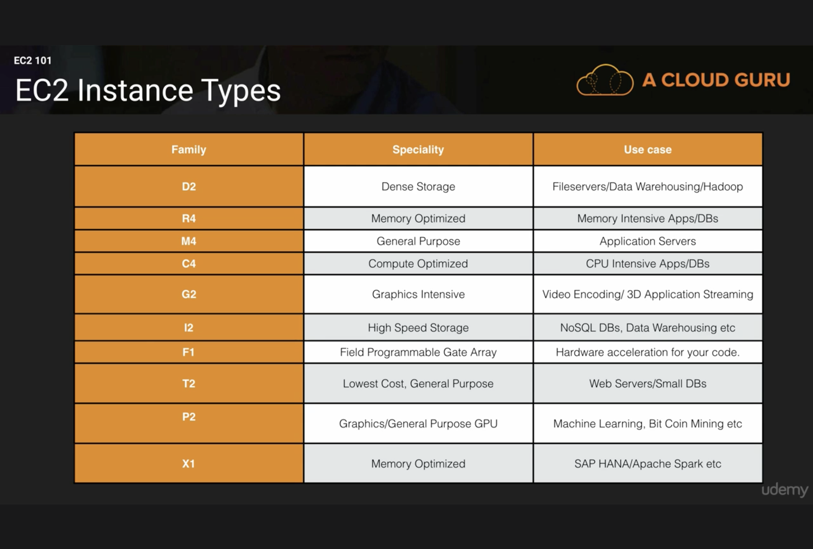
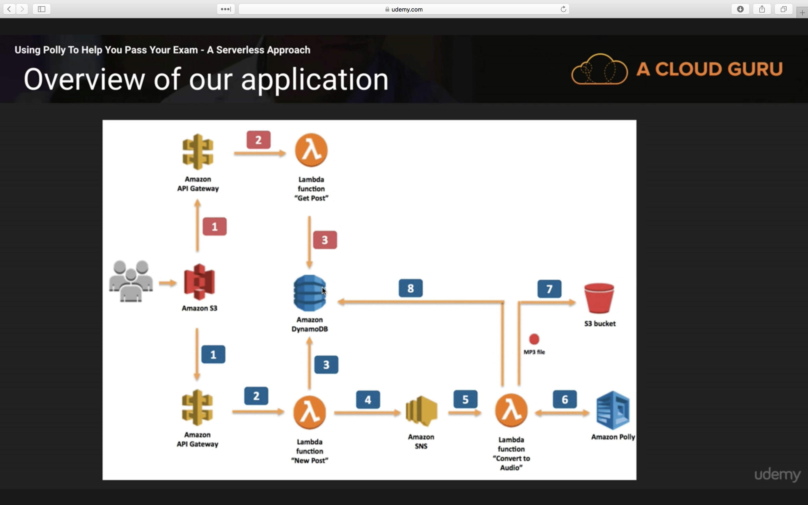

# AWS Services (2017)

## Compute

### VPC - Virtual Private Cloud

- Connect one to another

### Route53

DNS

- DNS 53 port
- Route 66 (US highway)

### Cloud Front

CDN Edge locations that will cache assets

- More Cloud Fronts than Availability Zones
- Origin: the source of all files a CDN will distribute
- Distribution: the name given to a CDN which is a collection of all Edge locations
- Edge locations allow write access
- Cached until TTL
- Can force cache clear (additional fee)

#### Supported Distribution Types

- Web for websites
- RTMP for media streaming

#### Restrict Viewer Access

- Use pre-signed (validated) URLs or cookies
  - e.g how acloud.guru platform ensures you're not sharing video links
- Geo Restrictions: whitelist/blacklist countries
- Invalidation - create a rule to pull back sensitive objects before its natural expiration
  - Rules are specified as file paths which may include wildcards, e.g. `/images/staff/*`
  - 1,000 invalidation paths per month included free
  - Max 3,000 invalidations in progress at once
  - Alternatively use versioned objects or directory names, both are faster/cheaper

### Direct Connect

Directly connect datacenter to AWS without going over internet

- Used for moving lots of data and security

### EC2 - Elastic Compute Cloud

Virtual machines in the cloud

- Like VM Ware
- Resizable, scale up and down to meet requirements
- Boots in minutes

#### Pricing

- On Demand - hourly rate, no commitment
- Reserved - 1-3 year terms, hourly rate discount
  - Pay upfront
  - Supplement with On Demand for high traffic times
- Spot - bid whatever price you want
  - great if your applications have flexible start/end time
  - e.g. mapping genetic genome
  - Interesting - You will not be charged for partial hour of usage if the platform terminates your usage. But will be charged if you terminate the instance.
- Dedicated Host - dedicated, physical machine, still hourly rate without commitment
  - For using software that has "dedicated host" licensing
  - Regulatory, non multi-tenant

#### Instance types

- D for Density
- R for RAM
- M - main choice for general purpose apps
- C for Compute
- G - Graphics
- I for IOPS
- F for FPGA
- T cheap general purpose (think T2 Micro)
- P - Graphics (think Pics)
- X - Extreme Memory

### EC2 Container Service

- Like Docker
- Don’t have to administrate/install

### Elastic Beanstalk

Inspects code and auto provisions all infrastructure

### Lambda

Server-less event-based app server

- No access to OS (serverless)
- Upload code and code will respond to events
- Runs Alex skills
- AWS Lambda is a compute service where you can upload your code and
create a Lambda function. AWS Lambda takes care of provisioning and
managing the servers that you use to run the code. You don’t have to worry about operating systems, patching, scaling, etc. You can use Lambda in the following ways.
- As an event-driven compute service where AWS Lambda runs
your code in response to events. These events could be changes
to data in an Amazon S3 bucket or an Amazon DynamoDB table.
- As a compute service to run your code in response to HTTP
requests using Amazon API Gateway or API calls made using
AWS SDKs. This is what we use at A Cloud Guru

#### History of Cloud Computing

Evolution of compute resource abstraction:
1. Data Center
1. IAAS
1. PAAS
1. Containers
1. Serverless (e.g. Lambda)

- Lambda functions respond to event triggers

### Lightsail

Out of the box cloud

- New in 2016
- E.g. Wordpress cloud
- For people who don’t know how to use cloud

## Storage

### S3 - Object-based file store

- Text, images, movies
- Used by Dropbox
- Glacier - Archive S3 files
- Regulatory requirements to store files for years, retrieve latency in hours (3-4 hours)
- Extremely low cost

Features:
- Encryption - multiple options
- Tiered storage
  - S3 (standard)
    - Availability: 99.99%
    - Concurrent facility fault tolerance: 2
  - Reduced Redundancy Storage
    - Concurrent facility fault tolerance: 1
    - Durability: 99.99%
    - E.g. store images in a standard bucket and thumbnails in a RRS bucket.
  - S3 IA (infrequently accessed)
    - Availability: 99.9%
    - Concurrent facility fault tolerance: 2
    - As reliable as standard S3
    - Still allows for rapid retrieval
    - Fee-based retrieval
  - Glacier
    - very cheap
    - 3-5 hours for retrieval
    - $0.01 / GB / month
- Lifecycle Management
- Versioning - multiple versions of a given file

Pricing:
- Storage (size)
- Requests
- Storage Management Pricing
- Data transfer Pricing
  - Inbound is Free
  - Intra-AWS movement is chargeable
- S3 Transfer Acceleration
  - Using CloudFront and Edge locations
  - About 35% faster when enabled for farthest distances around the word

Availability:
- Built for 99.99% availability for the S3 platform.
- Amazon Guarantee 999% availability.
- Amazon guarantees 99.999999999% durability for S3 information. (Remember 11 x 9’3).
  - Called the "11:9" durability guarantee

Files:
- File size **0 bytes** to **5 TB**
  - So empty files are allowed? Encode all your data as S3 filenames and pay nothing for storage!
- Files larger than 5GB requires multi-part upload

Buckets:
- Universal namespace for buckets
- DNS name created for each bucket
  - Format: `https://s3-<region>.amazonaws.com/<bucket-name>`

Data consistency:
- Read after write for new objects
- Eventual consistency for overridden or deleted objects
  - Can take time to propagate

Data parts:
- key
  - Designed to sort lexicographically
  - Storing many files with similar names can lead to performance bottlenecks in S3 storage-- apparently?
  - Add random salt to beginning of the filename for even distribution
- value
- version Id
- Metadata
- Sub-resources
  - Access Control Lists
  - Torrent

#### Use S3 to host a static website

A url is generated for you:
`http://<bucket-name>.s3-website.<region>.amazonaws.com`
`http://mrobbins.s3-website.us-east-2.amazonaws.com/index.html`

- Provide and index.html and error.html and make the public.

##### CORS - Cross Origin Resource Sharing

- In the secondary resource bucket enables CORS and add an allow rule for the main bucket site.
- Note there seems to be a delay after changing CORS rules before their reflected (minutes).

#### Serverless Webpage with API Gateway and Lambda

1. Create an S3 static site
1. Create a Lambda function that is triggered by an API Gateway calls
1. Lambda should return you some interesting data, like a string or image
1. Lambda function must set the CORS headers for your site to access
1. In your static site, make an call to your API Gateway that was created for you.

#### Using Route 53 to give your site a domain name

1. Enable Alias mode
1. Select your S3 bucket with the same name. **The bucket name must be identical to the domain name**

#### Versioning

- Deleting a version (via the console) is irreversible
- With versioning enabled for an object, deleting the object IS reversible because a Delete Marker is set for that object. Deleting the delete marker will un-delete the object.
- Effective billed volume is equal to the sum of all your version sizes
- Delete Marker file is created
- Once enabled, versioning CANNOT be disabled, only suspended.
- Integrates with Lifecycle rules
- Enable multi-factor verification for delete operations

#### Cross-Region Replications

- Disaster recovery strategy
- Requires Versioning to be turned on for the source AND destination buckets
- replicate whole bucket or objects with name prefix
- Replication only applies to new objects in the bucket
  - If you add a version to an existing object (created pre-replication) then ALL versions of that object will be replicated
- multiple cross-region replication not supported. i.e. no daisy-chaining
  - E.g. Replication setup: Bucket A -> B -> C. Add file to A, it will be replicated to B but not C.
- Delete markers are replicated

#### Bucket Access Control

- All new buckets are PRIVATE
- Main control methods: Bucket Policies, Access Control Lists
- Bucket request Logs

#### Bucket Encryption

- In Transit via SSL/TLS
- Four methods of encryption at rest:
  - Server Side Encryption (SSE):
    1. SSE-S3: S3 managed (256 bit)
    2. SSE-KMS: AWS Key Management Service, Managed Key, key envelope additional layer
    3. SSE-C: Customer provided keys
  - Client side encryption

#### S3 Transfer Acceleration

- Uses CloudFront Edge Network to speed up data Transfer
- Optimized paths back to Amazon's network.
- Upload directly to an edge location using a special URL
- The farther your are from the Bucket region, the faster the upload

### EFS - Elastic File Service

Amazon Elastic File System (Amazon EFS) is a file storage service for
Amazon Elastic Compute Cloud (Amazon EC2) instances. Amazon EFS is
easy to use and provides a simple interface that allows you to create and
configure file systems quickly and easily. With Amazon EFS, storage capacity
is elastic, growing and shrinking automatically as you add and remove files,
so your applications have the storage they need, when they need it.

- Can install database/applications here
- Storage Gateway - Virtual machine install on-premises
- File based storage and you can share it between multiple virtual servers

### Storage Gateway

- Service that connects an on-premises appliance with cloud-based storage for seamless/secure integration between heterogenous IT environments (i.e. hybrid cloud)
- VM image installed on a host in your datacenter

Four types:
1. File Gateway (NFS)
  - Flat file store
  - An S3 bucket mounted as NFS mount point
2. Volumes Gateway (iSCSI)
  - Block-based storage (i.e. virtual harddisks suitable for OSes, applications)
  - Stored Volumes - entire copy on-premises
    - Async backup to S3 in form of Amazon Elastic Block Store (EBS) snapshots
    - 1 GB - 16 TB in size
  - Cache Volumes - only most recent version on-premises
3. Tape Gateway (VTL)

### EBS - Block Storage

Storage to pair with EC2 instance

- Cannot mount one EBS to multiple EC2
- Backup within an availability zone
- Changed on the fly except for Magnetic type
  - Max 1 on-the-fly change per 6 hour period
- Volume size can only be scaled up
- Must be in the same availability zone
  - No migration tool for EBS volumes
  - Need to create a snapshot then create a volume in a different region

#### Instance types

- GP2 - General purpose SSD
  - 3 IOPS per GB, 10k max, bursting
- Provisioned IOPS SSD
  - IO intensive apps
  - use for >10k IOPS, 20k max
- ST1 - Throughput Optimized HDD
  - Magnetic
  - Sequential data
  - log processing, data warehousing
  - can't be boot volumes
- SC1 - Cold HDD
  - cheapest for infrequently accessed workloads
  - e.g. file server
  - can't be booted
- Magnetic (Standard)
  - IS Bootable
  - cheapest bootable storage device

## Databases

### RDS - Relational Database Service

Supports:
- MySql
- MariaDB
- Postgres
- SqlServer
- Oracle
- Aurora (MySQL and Postgres)

### DynamoDB

No SQL database

- Highly scalable

### Redshift

Data warehouse

- Don’t run reports on production database - performance impact
- Copy prod DB to redshift and run reporting, long jobs

### Elasticache

Cache data in cloud

- Example: Web store - serve top 10 products on your site that never change
- Take a load off prod database

## Migration Services

### Snowball

Import/export disks into Amazon

- Briefcase storage appliance for loading terabytes of data
- Only works with S3

Snowball:
- 80TB Briefcase
- 256 AES encryption
- Chain of custody

Snowball Edge:
- 100 TB on-board storage AND compute capability
- mini AWS datacenter
- Bring compute capacity where you otherwise couldn't, like collecting test data on an airplane
- Run lambda functions

SnowMobile
- 45 ft shipping container on semi-truck
- 100 PB of capacity

### DMS - Database Migration Services

Migrate on-premise database to cloud

- Migrate database to Redshift
- Converts one database type to another
- Stepping on Oracle toes for licensing fees
- No down-time replication
- Supports Oracle, Sql, Aurora, ASC, etc

### SMS - Server Migration Service

Migrate VM Ware virtual machines to cloud

- 50 concurrent uploads

## Analytics

### Athena

Run sql queries on S3

- Turing CSV or flat files into searchable tables

- EMR - Elastic Map Reduce
- Big data processing
- Process large amounts of data
- Logs, financial markets
- Backed by Hadoop or Apache Spark

### Cloudsearch

Search engine for website

- Fully managed

### Elastic Search

Search engine for website

- OSS

### Kinesis

Stream and analyze real time data

- Analyze social media or financial markets
- Terabytes of data per hour

### Data Pipeline

Data mover

- E.g. S3 → DynamoDB

### Quick Sight

Business analytics tool

- Analyze data, e.g. S3
- Charts and dashboards

## Security and Identity

### IAM - Identity Access Management

- Every certification exam
- User access control
- Platform sign-in
- Shared access to AWS account
- Identity federation (AD, Facebook, Linkedin)
- Multi-factor authentication
- Temporary access for users/devices
- 1 to 36 hour valid tokens

#### terms

- Users
- Groups
- Roles
- Polices

### Inspector

Inspects VMs, runs audits

### Certificate Manager

- Free certificates for your domain

### Directory Service

Integrate Active Directory (Microsoft) with AWS

### WAF - Web Application Firewall

- Prevent SQL injection, XSS

### Artifacts

Download Compliance documentation in the AWS Console

### STS - Security Token Service

Grand temporary access

- uses SAML - Security Assertion Markup Language
- Does not need to be an existing user
- Alternate to IAM - Allows user to sign on to AWS Console without IAM credentials
- Cross AWS account access

#### terms

- federation
- Identity broker - not out of the box, need to create your own
- Identity store - AD, Facebook, Google, etc
- Identities - end users

#### Scenario - Enterprise web app on AWS is secured by corporate LDAP, uses S3.

1. Develop an Identity Broker to authenticate with LDAP
1. Identity Broken then communicates with STS (IAM GetFederationToken function)
1. Application gets temporary access to resources (S3) - getting temporary access key, secret access key, token, and duration

### Web Identity Federation

#### terms

- Trust Policy
- ProviderId
- RoleArn - Role Amazon Resource Name

## Management Tools

### Cloud Watch

Monitor hardware usage

### Cloud Formation

Way of turning your infrastructure into code

Declarative configuration

- Cloud Formation templates
- Single command, provision many servers

### Cloud Trail

Audit changes to AWS environment

### Opsworks

### Config

Active monitoring, alerts on your environment

- E.g. Someone creates a new security group in violation of policy, Config will trigger an alert

### Service Catalog

Enterprise catalog for curating what services/configurations are allowed by your organization on the AWS Platform

### Trusted Advisor

Automated scanning/recommendation engine for users

- Give tips for maximizing performance, minimize costs

## Application Services

### Step Functions

Monitor what's going on inside your applications

- E.g. what microservices is your app using?
- New in 2016

### SWF - Simple Workflow Services

Facilitate automated + human workflows

- E.g. placing an Amazon physical good order
  - User places order, computer routes to warehouse, human picks order form shelf

### API Gateway

A door to create/publish/maintaining/secure to access backend services (APIs) "at scale"

### AppStream

Streaming desktop apps to your users

### Elastic Transcoder

Video transcoding for creating different formats of a video to target devices

## Developer Tools

### CodeCommit

Amazon's Github

### CodeBuild

- New in 2016
- Pay by the minutes

### CodeDeploy

### CodePipeline

Keep track of which versions of code in which environments

## Mobile Services

### Mobile Hub

Web console for mobile apps

- Add, configure, and design features for mobile apps

### Cognito

Service for signup/signin with social media authentication

- OAUTH?
- See CG course on building an Instagram clone
  - store images in S3
  - store metadata in DynamoDB
  - trigger lambda function to create thumbnails

### Device Farm

Test android/ios devices on hundreds of devices

### Mobile Analytics

Collect/analyze mobile app usage

### Pinpoint

Track user behavior patterns, create campaigns, engage users

- Like Google Analytics

## Business Productivity

### WorkDocs

Storing work docs in S3

### WorkMail

Exchange for AWS

## iOT - Internet of Things

## Desktop & App Streaming

### Workspaces

VDI for AWS

* run Windows environment in AWS

### AppStream 2.0

Stream desktop apps to users

## Artificial Intelligence

- Superintelligence by Nick Bostrom
  - Paths, Dangers, Strategies
  - Tweeted by Elon Musk

### Alexa

Voice service in the Cloud

* Talking to Lambda
* Lex - software core of Alexa. Allows you to embed Alexa in other devices.

### Polly

Text to Voice

### Machine Learning

### Rekognition

* Upload picture and it will return tags
* Facial recognition with percentage match

#### Demo app idea

Upload photos and retrieve tags for what's stored in them. Download them and add them back to the original image.

## Messaging

### SNS - Simple Notification Services

### SQS - Simple Queuing Service

Decouple applications using queues

### SES - Simple Email Service
