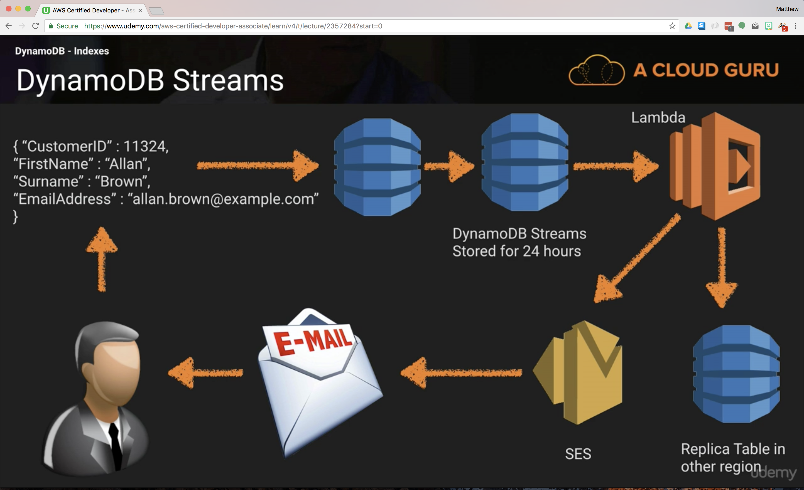

## Databases 101

### Use cases

#### OLTP - On-line Transaction processing

- Real time, narrow scope
- e.g. looking up an order

#### OLAP - On-line Analytics processing

- Large batches
- e.g. sum of orders of a certain type
- Use a copy of your database (called DB warehouse)

## DynamoDB

### Keys

#### Primary Key

- Primary key can be simple (partition key) or composite (partition key and sort key)

#### Partition Key

- Partition (formerly "hash") key
- hash(pkey) --> physical partition location of data on disk
- e.g. user Id, device Id
  - bad: status code (when there are few), create date
- don't use an attribute for partition key where a value is magnitudes more popular than others

#### Composite Keys

- Partition Key + Sort Key
- Sort key is a range
- e.g. discussion forum app where each comment is from a user and creates a unique entry in the table
- two entries CAN have the same partition key, but MUST have DIFFERENT sort keys
- all items with the same partition will be stored together, sorted by the Sort key
  - performance design considerations

### Indexes

#### Global Secondary Index

- DIFFERENT partition key (used for base table) and DIFFERENT sort key
- Can be created at table creation or added later
- Max 5 per table
- "global" because queries on the index can span all of the data in the base table, across all partitions.
- Queries support eventual consistency only (makes sense as, guaranteed consistency would blocks write operations until whole table is scanned)
- Query results will only return attributes projected into the index

#### Local Secondary Index

- SAME partition key (used for base table), DIFFERENT sort Keys
- can ONLY be created when creating a table
- CANNOT be modified or deleted later
- Max 5 per table
- "local" in the sense that every partition of a local secondary index is scoped to a base table partition that has the same partition key value.
- allows queries over a single partition, as specified by the partition key in the query
- Query results may include attributes not projected into the index

### Streams

- Every DynamoDB operation insert/update/delete is stored in a 24 hour stream reservoir.
- Can create triggers for Lambda functions
- Is stream subscriptions supported?



### DynamoDB Queries

Types:
- Query
- Scan

#### Query

- Eventual consistent read by default
- Must provider partition key and exact value
- Optionally, can provide sort key for additional filtering within partition

#### Scan

- Examines EVERY item in the table
- Worse performance - can occupy all provisioned throughput

- `ProjectionExpression` parameter - narrow the returned attributes
- Results are sorted ascending by default
  - Set `ScanIndexForward` to `false` for descending sort

### Provisioned throughput calculations

- If you exceed your configured throughput, you will receive a HTTP 400 error response with a relevant error message

#### Required Read units

Constants:
- A read unit can read up to 4KB at a time
- For Eventually Consistent Reads (ECRs) units can read 2 / second
- For Strongly Consistent Reads (SCRs) units can read 1 / second

Assuming all items to read are the same size:
```
ceil(itemSize/4) = readsRequired
readsRequired * itemCount = readsRequiredPerSecond
readsRequiredPerSecond/1 = readUnitsRequiredForScrs
readsRequiredPerSecond/2 = readUnitsRequiredForEcrs
```

#### Required Write units

Constants:
- A write unit can read up to 1KB at a time

Assuming all items to read are the same size:
```
ceil(itemSize/1) = writesRequired
writesRequired * itemCount = writesRequiredPerSecond = writeUnitsRequiredPerSecond
```

### Miscellaneous

#### Conditional writes

- Apply a pre-condition to a write operation. Write will not occur if check fails.
- E.g. check the value of a price field before discounting it.
- Useful to protect against cases of multiple concurrent writes (mistakenly discounting twice!)
- Called idempotent - denoting an element of a set that is unchanged in value when multiplied or otherwise operated on by itself

#### Atomic Counters

- Not idempotent - increments each time an operation in called, but run the risk of performing an operating multiple times
